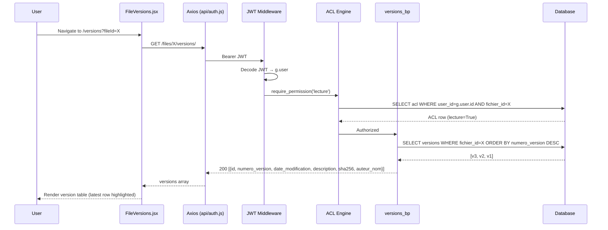
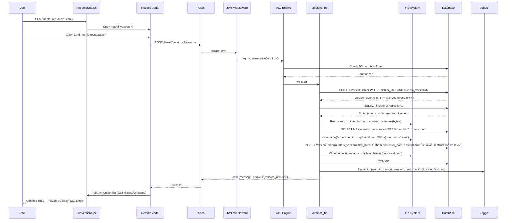

# Design Document: File Version Restore

## Overview

Transferly already tracks every file mutation as a `VersionFichier` row and archives the encrypted binary on disk. This feature exposes that history to end-users through a polished UI: they can browse the version list for any file they own (or have `ecriture` access to), click **Restore**, confirm in a modal, and have the file content atomically rolled back — while the current state is automatically preserved as a new version entry so nothing is ever lost.

The backend endpoint (`POST /files/<id>/versions/<num>/restore`) already exists in `app/routes/version.py` and is registered in the app factory. The frontend page (`FileVersions.jsx`) already renders the list and calls the restore endpoint. The primary design work is therefore about **hardening the existing backend logic**, **wiring the frontend correctly**, and **ensuring the full flow is coherent and tested end-to-end**.

---

## Architecture

```mermaid
graph TD
    subgraph Frontend ["React 19 Frontend"]
        MF[MyFiles.jsx<br/>History button → /versions?fileId=X]
        FV[FileVersions.jsx<br/>Version list + Restore button]
        RM[RestoreModal<br/>Confirmation dialog]
        API[api/auth.js<br/>Axios instance + JWT interceptor]
    end

    subgraph Backend ["Flask Backend"]
        MW[JWT Middleware<br/>g.user injection]
        ACL[ACL Engine<br/>require_permission decorator]
        VR[versions_bp<br/>GET /files/:id/versions/<br/>POST /files/:id/versions/:num/restore]
        FS[File System<br/>uploads/user_{id}/{fichier_id}.enc<br/>uploads/user_{id}/{fichier_id}_v{n}.enc]
        DB[(SQLite<br/>fichiers + versions tables)]
        CRYPTO[crypto.py<br/>Fernet AES-128]
        LOG[logger.py<br/>log_action()]
    end

    MF -->|navigate /versions?fileId=X| FV
    FV -->|GET /files/:id/versions/| API
    FV -->|POST /files/:id/versions/:num/restore| API
    API -->|Bearer JWT| MW
    MW --> ACL
    ACL -->|lecture| VR
    ACL -->|ecriture| VR
    VR -->|read/write .enc files| FS
    VR -->|query/update| DB
    VR -->|log_action| LOG
    FS <-->|encrypt/decrypt| CRYPTO
```

---

## Sequence Diagrams

### List Versions Flow



### Restore Version Flow



---

## Components and Interfaces

### Backend: `versions_bp` (app/routes/version.py)

**Purpose**: Handles all version-related HTTP operations for a given file.

**Interface**:
```
GET  /files/<fichier_id>/versions/
  Auth: Bearer JWT, ACL lecture
  Response 200: List[VersionDTO]
  Response 401: {error}
  Response 403: {error, code}
  Response 404: {error}

POST /files/<fichier_id>/versions/<numero_version>/restore
  Auth: Bearer JWT, ACL ecriture
  Response 200: {message: str, nouvelle_version_archivee: int}
  Response 401: {error}
  Response 403: {error, code}
  Response 404: {error}  — fichier or version not found, or binary missing on disk
  Response 500: {error}  — unexpected failure (rolled back)
```

**VersionDTO** (returned by GET):
```
{
  id: int
  numero_version: int
  date_modification: str | null   # ISO 8601
  description: str | null
  sha256: str | null
  auteur_nom: str | null
}
```

**Responsibilities**:
- Enforce ACL via `require_permission` decorator (imported from `app.routes.acl`)
- Validate that both the `Fichier` and `VersionFichier` records exist before any disk I/O
- Perform atomic archive-then-restore: read target binary → rename current → write restored → commit DB
- Roll back DB transaction on any exception
- Log every restore attempt (success and failure) via `log_action`

**Known gap to address**: The `restore_version` handler currently does not set `auteur_id` on the newly created archive `VersionFichier` row. It should be set to `g.user['id']`.

### Frontend: `FileVersions.jsx` (src/pages/FileVersions.jsx)

**Purpose**: Full-page view listing all versions of a file with restore capability.

**Interface** (props/state):
```
State:
  versions: VersionDTO[]
  fileName: string
  loading: boolean
  restoreTarget: VersionDTO | null
  restoring: boolean
  toast: {type: 'success'|'error', message: string} | null

URL param: ?fileId=<id>
```

**Responsibilities**:
- Fetch version list on mount via `GET /files/:id/versions/`
- Fetch file name from `GET /files/` (already implemented)
- Render `VersionRow` for each version; mark `i === 0` as latest (highest `numero_version` since list is DESC)
- Open `RestoreModal` on "Restaurer" click
- Call `POST /files/:id/versions/:num/restore` on confirm
- Refresh version list after successful restore
- Show success/error toast

**Known gap to address**: `FileVersions.jsx` fetches the file name by calling `GET /files/` and scanning the full list. This is inefficient and will fail for files shared with the user (not in their own list). A `GET /files/:id` endpoint should be used instead — or the file name should be passed as a query param from the navigation call site.

### Frontend: `api/auth.js`

The `restoreVersion` helper is already exported:
```javascript
export const restoreVersion = (fileId, n) =>
  API.post(`/files/${fileId}/versions/${n}/restore`);
```
`FileVersions.jsx` currently calls `API.post(...)` directly rather than using this helper. Both approaches work; the helper should be preferred for consistency.

### Frontend: `MyFiles.jsx`

Already navigates to `/versions?fileId=${file.id}` from both the context menu "Historique" item and the grid-mode history button. No changes needed here.

---

## Data Models

### VersionFichier (existing, `app/models/version.py`)

```
id               Integer  PK
numero_version   Integer  NOT NULL
date_modification DateTime DEFAULT utcnow
description      String(300)
chemin           String(500)        # path to the archived .enc binary
sha256           String(64)         # SHA-256 of the plaintext content
auteur_id        Integer  FK→users.id  NULLABLE
fichier_id       Integer  FK→fichiers.id  CASCADE DELETE
```

**Invariants**:
- `(fichier_id, numero_version)` must be unique — enforced by application logic (MAX query + 1)
- `chemin` for archived versions points to `uploads/user_{owner_id}/{fichier_id}_v{n}.enc`
- `chemin` for the initial version (v1) points to the canonical path `uploads/user_{owner_id}/{fichier_id}.enc` (same as `Fichier.chemin`) — this is intentional; the canonical file IS v1 until a second version is created

### Fichier (existing, `app/models/fichier.py`)

```
id             Integer  PK
nom            String(200)  NOT NULL
taille         Float
date_creation  DateTime DEFAULT utcnow
chemin         String(500)   # canonical path: uploads/user_{user_id}/{id}.enc
user_id        Integer  FK→users.id
espace_id      Integer  FK→espaces.id  NULLABLE
folder_id      Integer  FK→folders.id  NULLABLE
```

**Validation Rules**:
- `chemin` always points to the live, current encrypted binary
- After restore, `Fichier.chemin` is unchanged (same canonical path); only the file content at that path changes

---

## Key Functions with Formal Specifications

### `restore_version(fichier_id, numero_version)` — POST handler

**Preconditions**:
- `g.user` is set (JWT middleware ran)
- ACL entry for `(g.user.id, fichier_id)` has `ecriture = True` (enforced by decorator)
- `VersionFichier` with `(fichier_id, numero_version)` exists in DB
- `version_cible.chemin` is a non-empty string and the file exists on disk
- `Fichier` with `id = fichier_id` exists in DB

**Postconditions** (on success):
- The file at `fichier.chemin` (canonical path) contains the encrypted bytes that were previously at `version_cible.chemin`
- A new `VersionFichier` row exists with `numero_version = old_max + 1`, `chemin = archive_path`, `auteur_id = g.user['id']`, `description = "État avant restauration de la v{numero_version}"`
- The old canonical binary has been moved to `archive_path`
- DB transaction is committed
- `log_action` called with `statut='succes'`

**Postconditions** (on failure):
- DB transaction is rolled back
- Disk state is best-effort (if rename succeeded but write failed, the canonical path may be empty — see error handling section)
- `log_action` called with `statut='echec'`

**Loop Invariants**: N/A (no loops)

### `get_versions(fichier_id)` — GET handler

**Preconditions**:
- `g.user` is set
- ACL entry for `(g.user.id, fichier_id)` has `lecture = True`

**Postconditions**:
- Returns list of all `VersionFichier` rows for `fichier_id`, ordered by `numero_version DESC`
- Each item includes `auteur_nom` resolved from `User.query.get(v.auteur_id)` (None if `auteur_id` is null)
- No mutations to DB or disk

---

## Algorithmic Pseudocode

### Restore Algorithm

```pascal
PROCEDURE restore_version(fichier_id, numero_version)
  INPUT: fichier_id (int), numero_version (int), g.user (injected)
  OUTPUT: HTTP 200 | 404 | 500

  BEGIN
    // 1. Load target version
    version_cible ← DB.query(VersionFichier,
                              fichier_id=fichier_id,
                              numero_version=numero_version)
    IF version_cible IS NULL THEN
      RETURN 404 {"error": "Version introuvable"}
    END IF

    IF version_cible.chemin IS NULL
       OR NOT file_exists(version_cible.chemin) THEN
      RETURN 404 {"error": "Binaire de la version absente du disque"}
    END IF

    // 2. Load current file record
    fichier ← DB.query(Fichier, id=fichier_id)
    IF fichier IS NULL THEN
      RETURN 404 {"error": "Fichier introuvable"}
    END IF

    // 3. Compute next archive version number
    max_num ← DB.max(VersionFichier.numero_version, fichier_id=fichier_id)
    next_num ← max_num + 1
    archive_path ← "uploads/user_{fichier.user_id}/{fichier_id}_v{next_num}.enc"

    // 4. Read restored bytes BEFORE touching disk
    contenu_restaure ← read_bytes(version_cible.chemin)

    // 5. Archive current canonical binary
    IF fichier.chemin IS NOT NULL AND file_exists(fichier.chemin) THEN
      rename(fichier.chemin → archive_path)
    ELSE
      archive_path ← fichier.chemin  // nothing to move
    END IF

    // 6. Create archive version record
    nouvelle_version ← VersionFichier(
      numero_version = next_num,
      description    = "État avant restauration de la v{numero_version}",
      chemin         = archive_path,
      auteur_id      = g.user['id'],   // FIX: was missing in original
      fichier_id     = fichier_id
    )
    DB.add(nouvelle_version)

    // 7. Write restored bytes to canonical path
    write_bytes(fichier.chemin, contenu_restaure)

    // 8. Commit and log
    DB.commit()
    log_action(g.user['id'], 'restore_version',
               resource_id=fichier_id, statut='succes',
               details="restaurée v{numero_version}")

    RETURN 200 {
      "message": "Version {numero_version} restaurée avec succès.",
      "nouvelle_version_archivee": next_num
    }

  EXCEPTION e:
    DB.rollback()
    log_action(g.user['id'], 'restore_version',
               resource_id=fichier_id, statut='echec', details=str(e))
    RETURN 500 {"error": str(e)}
  END
END PROCEDURE
```

---

## Example Usage

```javascript
// Frontend: trigger restore from FileVersions.jsx
const handleRestoreConfirm = async () => {
  setRestoring(true);
  try {
    await API.post(`/files/${fileId}/versions/${restoreTarget.numero_version}/restore`);
    const fresh = await API.get(`/files/${fileId}/versions/`);
    setVersions(fresh.data);
    setToast({ type: 'success', message: `Version v${restoreTarget.numero_version} restaurée avec succès.` });
  } catch (err) {
    const msg = err.response?.data?.error || 'Erreur lors de la restauration.';
    setToast({ type: 'error', message: msg });
  } finally {
    setRestoring(false);
    setRestoreTarget(null);
    setTimeout(() => setToast(null), 3500);
  }
};
```

```python
# Backend: programmatic restore (simplified)
# POST /files/42/versions/2/restore
# Before: fichier.chemin = "uploads/user_3/42.enc" (contains v3 content)
#         VersionFichier rows: v1(chemin=42.enc), v2(chemin=42_v1.enc), v3(chemin=42_v2.enc)
# After:  fichier.chemin = "uploads/user_3/42.enc" (now contains v2 content)
#         New row: v4(chemin=42_v4.enc, description="État avant restauration de la v2")
```

---

## Correctness Properties

*A property is a characteristic or behavior that should hold true across all valid executions of a system — essentially, a formal statement about what the system should do. Properties serve as the bridge between human-readable specifications and machine-verifiable correctness guarantees.*

### Property 1: Non-destructive restore

For any `fichier_id` and any valid restore operation, the number of `VersionFichier` rows for that `fichier_id` strictly increases by exactly 1.

**Validates: Requirements 1.1, 1.2**

### Property 2: Content fidelity after restore

For any file and any archived version N, after restoring version N, downloading the file returns bytes that decrypt to the same plaintext as the binary stored at `version_cible.chemin` at the time of the restore call.

**Validates: Requirements 1.1**

### Property 3: Monotonic versioning

For any `fichier_id`, after any sequence of uploads, updates, and restores, all `numero_version` values for that file are distinct and form a strictly increasing sequence with no gaps.

**Validates: Requirements 1.1, 1.2**

### Property 4: auteur_id attribution on restore

For any restore operation performed by user U, the newly created archive `VersionFichier` row has `auteur_id` equal to U's user id.

**Validates: Requirements 1.1**

### Property 5: ACL enforcement on restore

For any user without `ecriture` permission on a `fichier_id`, the restore endpoint always returns HTTP 403, regardless of whether the target version exists.

**Validates: Requirements 1.2, 1.3**

### Property 6: Lock contention returns 423

For any `fichier_id` whose `FileLock` is currently held, any concurrent call to the restore endpoint returns HTTP 423.

**Validates: Requirements 1.3**

### Property 7: Single-file endpoint returns correct metadata

For any uploaded file, `GET /files/<fichier_id>` returns a response whose `id` and `nom` fields match the file's actual id and name.

**Validates: Requirements 2.1, 2.2**

### Property 8: Version preview round-trip

For any file and any archived version N, the content returned by `GET /files/<fichier_id>/versions/<N>/preview` decrypts to the same plaintext that was stored when version N was created.

**Validates: Requirements 3.1, 3.2**

### Property 9: Version download round-trip

For any file and any archived version N, the content returned by `GET /files/<fichier_id>/versions/<N>/download` decrypts to the same plaintext that was stored when version N was created.

**Validates: Requirements 4.1, 4.2**

### Property 10: ACL flags reflect actual permissions

For any authenticated caller and any `fichier_id`, the `permissions` object in the `GET /files/<fichier_id>/versions/` response has `can_restore`, `can_preview`, and `can_download` values that exactly match the caller's `ecriture`, `lecture`, and `download` ACL fields respectively (with `AdminGlobal` always receiving `true` for all three).

**Validates: Requirements 5.1, 5.2, 5.3, 5.4, 5.5, 5.6**

### Property 11: Idempotent listing

`GET /files/<fichier_id>/versions/` never mutates DB or disk state; calling it N times returns the same result given no concurrent writes.

**Validates: Requirements 5.1**

### Property 12: Rollback safety

If any step in the restore procedure raises an exception after the DB `add()` but before `commit()`, the DB transaction is rolled back and no new `VersionFichier` row is persisted.

**Validates: Requirements 1.2**

---

## Error Handling

### Version binary missing on disk

**Condition**: `version_cible.chemin` exists in DB but the `.enc` file has been deleted from disk (e.g., manual cleanup, storage migration).  
**Response**: HTTP 404 `{"error": "Binaire de la version absente du disque"}`  
**Recovery**: No disk or DB mutation occurs. The user sees an error toast. An admin can investigate via logs.

### Canonical file missing on disk

**Condition**: `fichier.chemin` does not exist on disk (e.g., partial upload failure).  
**Response**: The restore proceeds — `archive_path` is set to `fichier.chemin` (no rename), and the restored bytes are written to the canonical path. This effectively recovers the file.  
**Note**: This is the existing behavior in `version.py` and is acceptable.

### Concurrent modification (race condition)

**Condition**: Two users simultaneously attempt to restore or update the same file.  
**Current state**: The `PUT /files/<id>` endpoint uses a per-file `threading.Lock` (via `get_file_lock`). The restore endpoint does **not** currently acquire this lock.  
**Design decision**: The restore endpoint should acquire the same lock to prevent interleaving with concurrent updates. This is a gap to address in implementation.

### Insufficient permissions

**Condition**: User has `lecture` but not `ecriture` on the file.  
**Response**: HTTP 403 `{"error": "Accès refusé", "code": "FORBIDDEN", "detail": "Permission 'ecriture' non accordée"}`  
**Frontend**: The "Restaurer" button is shown to all users who can view the version list (they have `lecture`). The 403 will surface as an error toast. Ideally, the button should be hidden when the user lacks `ecriture` — this requires the versions list response to include the caller's permissions, or a separate ACL check on the frontend.

### File not found

**Condition**: `fichier_id` does not exist in DB.  
**Response**: HTTP 404 `{"error": "Fichier introuvable"}`

### Unauthenticated request

**Condition**: No or invalid JWT.  
**Response**: HTTP 401 from JWT middleware before the route handler is reached.

---

## Testing Strategy

### Unit Testing Approach

The existing `tests/test_versions.py` already covers the core scenarios with an in-memory SQLite database:

- `TestCreationVersion`: upload creates v1, PUT creates v2, multiple PUTs increment correctly
- `TestListingVersions`: 200 + correct fields, DESC order, 404 for unknown file, 403 without ACL, 401 without token
- `TestRestaurationVersion`: restore returns 200 + correct content, archive row created, 404 for unknown version, 403 without `ecriture`, 401 without token
- `TestVerrouConcurrent`: 423 when lock held, 200 after lock released

**Additional test cases to add**:
- Restore sets `auteur_id` on the new archive version row
- Restore acquires the file lock (concurrent restore + update returns 423 on one of them)
- Restore of a version whose binary is missing returns 404
- GET versions returns `auteur_nom` correctly (including null case)

### Property-Based Testing Approach

**Property Test Library**: `hypothesis` (already available in the Python ecosystem; add to `requirements.txt` if not present)

Key properties to test:
- **Monotonic version count**: After any sequence of uploads, updates, and restores, `COUNT(versions WHERE fichier_id=X)` equals the number of operations performed.
- **Content round-trip**: `encrypt(decrypt(read(chemin))) == read(chemin)` — the Fernet key is stable within a test session.
- **Version number uniqueness**: For any `fichier_id`, all `numero_version` values are distinct.

### Integration Testing Approach

Manual smoke test checklist (no automated E2E framework currently in the project):

1. Upload a file → verify v1 appears in `/versions?fileId=X`
2. Update the file → verify v2 appears, v1 still listed
3. Click Restore on v1 → confirm modal → verify toast success, list refreshes, v3 (archive of v2) appears
4. Download the file → verify content matches original upload
5. Attempt restore as a user without `ecriture` → verify 403 toast
6. Navigate to `/versions` without `?fileId` → verify fallback UI with "Retour aux fichiers" button

---

## Performance Considerations

- Version list queries are bounded by the number of versions per file. No pagination is needed for typical usage (tens of versions). If a file accumulates hundreds of versions, a `LIMIT` + cursor-based pagination could be added to the GET endpoint.
- The restore operation reads the entire archived binary into memory before writing it back. For large files this is acceptable given Fernet's streaming limitations in the current `crypto.py` implementation. If file sizes grow significantly, streaming encryption should be considered.
- The `GET /files/` call in `FileVersions.jsx` to resolve the file name loads all files for the user. This should be replaced with a dedicated `GET /files/:id` endpoint (or pass `fileName` as a query param from the navigation call site) to avoid O(n) overhead.

---

## Security Considerations

- **ACL enforcement**: All version endpoints are protected by `require_permission` which checks the `ACL` table. `AdminGlobal` bypasses ACL checks by design (consistent with the rest of the platform).
- **Encryption at rest**: All `.enc` files are Fernet-encrypted with the server's `.key` file. The restore operation copies encrypted bytes directly — no decryption occurs during restore, preserving the encryption guarantee.
- **Path traversal**: `archive_path` is constructed from `fichier.user_id` and `fichier_id` (both integers from the DB), not from user input. No path traversal risk.
- **SHA-256 integrity**: The existing `VersionFichier.sha256` field stores the hash of the plaintext at upload/update time. The restore endpoint does not recompute or validate SHA-256. For integrity verification, a future enhancement could compare the hash of the decrypted restored content against the stored `sha256` before committing.
- **Audit trail**: Every restore attempt (success and failure) is logged via `log_action`, providing a full audit trail visible in the Logs admin panel.

---

## Dependencies

**Backend** (all already present):
- `Flask` — web framework
- `SQLAlchemy` (via `flask-sqlalchemy`) — ORM
- `cryptography` — Fernet encryption (`app/crypto.py`)
- `PyJWT` — JWT decode in middleware
- `app.acl_engine.require_permission` — ACL decorator
- `app.services.logger.log_action` — audit logging

**Frontend** (all already present):
- `React 19` + `react-router-dom` — routing and state
- `axios` (via `api/auth.js`) — HTTP client with JWT interceptor
- `lucide-react` — icons (used in `MyFiles.jsx`; `FileVersions.jsx` uses inline SVGs)

**No new dependencies are required** to implement this feature.
