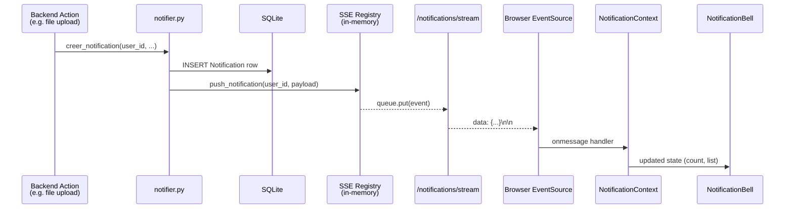
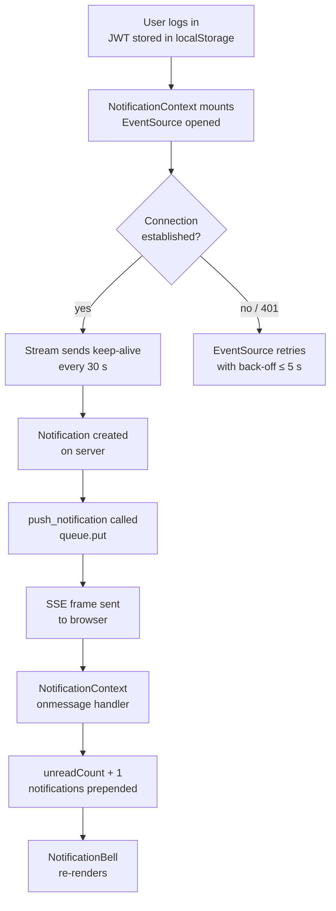

# Design Document — realtime-notifications

## Overview

This document describes the technical design for replacing the polling-based notification delivery in Transferly with a Server-Sent Events (SSE) push channel.

### Goals

- Notifications appear in the browser within 1 second of being created on the server.
- No new infrastructure is required (no WebSocket upgrade, no message broker).
- The existing REST notification endpoints and `Notification` model are untouched.
- The solution is compatible with Flask's threaded WSGI server and SQLite.

### Chosen Transport: SSE

SSE (Server-Sent Events) is a unidirectional HTTP/1.1 streaming protocol. The server holds a long-lived response open and writes `text/event-stream` frames into it. The browser's native `EventSource` API handles reconnection automatically.

SSE was chosen over WebSockets because:
- It works over plain HTTP/1.1 with no protocol upgrade.
- It is handled by Flask's existing threading model without async/await.
- It passes through the existing JWT middleware unchanged.
- The notification flow is strictly server → client; bidirectional messaging is not needed.

### Key Design Decisions

**In-memory queue registry (not database-backed):** Each active SSE connection is represented by a `queue.Queue`. A module-level dict maps `user_id → set[Queue]`. This is intentionally ephemeral — if the server restarts, clients reconnect and rebuild the registry automatically. No schema changes are needed.

**Push hook in `notifier.py`:** After writing the `Notification` row to the database, `creer_notification` calls a `push_notification(user_id, payload)` function. This keeps the SSE delivery co-located with notification creation and requires no changes to any caller of `notifier.py`.

**`NotificationContext` in React:** A single React context owns the `EventSource` lifecycle. All components read from this context instead of managing their own polling intervals. This eliminates duplicate connections and centralises reconnection logic.

---

## Architecture





---

## Components and Interfaces

### Backend

#### `app/services/sse_manager.py` (new)

Owns the in-memory registry and the push function.

```python
# Public interface
def register_queue(user_id: int) -> queue.Queue:
    """Add a new Queue to the registry for user_id. Returns the queue."""

def unregister_queue(user_id: int, q: queue.Queue) -> None:
    """Remove a queue from the registry. No-op if not present."""

def push_notification(user_id: int, payload: dict) -> None:
    """
    Serialize payload to an SSE event string and put it on every queue
    registered for user_id. Silently discards if no queues exist.
    Removes any queue that raises an exception on put().
    """
```

Internal state:

```python
_registry: dict[int, set[queue.Queue]] = {}
_lock: threading.Lock  # protects _registry mutations
```

#### `app/routes/notifications.py` (modified)

Adds the `/notifications/stream` route to the existing blueprint.

```python
@notifications_bp.route('/notifications/stream', methods=['GET'])
def sse_stream():
    """
    Authenticates via JWT (already handled by middleware).
    Returns a streaming response of type text/event-stream.
    Registers a queue, yields events, unregisters on disconnect.
    """
```

Response headers set on the stream:
- `Content-Type: text/event-stream`
- `Cache-Control: no-cache`
- `X-Accel-Buffering: no`
- `Connection: keep-alive`

#### `app/services/notifier.py` (modified)

After the `db.session.commit()` call, `creer_notification` calls `push_notification`:

```python
from app.services.sse_manager import push_notification

def creer_notification(user_id, type_notif, message, lien=None):
    try:
        notif = Notification(...)
        db.session.add(notif)
        db.session.commit()
        # Push to SSE after successful DB write
        push_notification(user_id, {
            'id': notif.id,
            'type': notif.type,
            'message': notif.message,
            'lien': notif.lien,
            'lu': notif.lu,
            'date_creation': notif.date_creation.isoformat()
        })
    except Exception as e:
        db.session.rollback()
        print(f'[NOTIF] Erreur: {e}')
```

`push_notification` must never raise — any exception from the SSE layer is caught internally.

### Frontend

#### `src/context/NotificationContext.jsx` (new)

```jsx
// Exposed context value shape
{
  notifications: Notification[],   // most-recent-first, capped at 30
  unreadCount: number,
  markAsRead: (id: number) => void,
  markAllAsRead: () => void,
}
```

Lifecycle rules:
- Opens `EventSource` when a JWT is present in `localStorage`.
- Closes `EventSource` on logout (JWT removed) or when the component unmounts.
- On `visibilitychange` to `visible`, checks `eventSource.readyState` and reopens if `CLOSED`.
- Handles `message` events of type `notification` by prepending to `notifications` and incrementing `unreadCount`.
- `markAsRead(id)` calls `PUT /notifications/<id>/lu`, updates local state optimistically.
- `markAllAsRead()` calls `PUT /notifications/tout-lu`, sets all local `lu = true` and `unreadCount = 0`.

#### `src/components/NotificationBell.jsx` (modified)

- Removes the `setInterval` polling loop.
- Removes local `notifs` and `count` state.
- Reads `{ notifications, unreadCount, markAsRead, markAllAsRead }` from `NotificationContext`.
- All rendering logic (badge, dropdown) remains unchanged.

#### `src/App.jsx` (modified)

Wraps the router tree with `<NotificationProvider>` so the context is available to all authenticated routes.

---

## Data Models

No schema changes. The existing `Notification` model is used as-is:

| Field | Type | Notes |
|---|---|---|
| `id` | Integer PK | |
| `user_id` | Integer FK → users | |
| `type` | String(40) | e.g. `upload_espace`, `invitation` |
| `message` | String(300) | Human-readable text |
| `lien` | String(200) | Optional navigation path |
| `lu` | Boolean | `False` = unread |
| `date_creation` | DateTime | UTC, set on insert |

### SSE Event Wire Format

Each event pushed to the browser follows the `text/event-stream` format:

```
event: notification
data: {"id": 42, "type": "invitation", "message": "...", "lien": "/espace/7", "lu": false, "date_creation": "2025-01-15T10:30:00"}

```

Keep-alive frames (no data, prevents proxy timeout):

```
: keep-alive

```

Retry hint sent once at stream open:

```
retry: 5000

```

### In-Memory Registry Shape

```python
_registry: dict[int, set[queue.Queue[str]]]
# key   = user_id (int)
# value = set of Queue objects, one per active SSE connection for that user
```

---

## Correctness Properties

*A property is a characteristic or behavior that should hold true across all valid executions of a system — essentially, a formal statement about what the system should do. Properties serve as the bridge between human-readable specifications and machine-verifiable correctness guarantees.*

### Property 1: SSE event payload completeness

*For any* `Notification` object created by `creer_notification`, the SSE event payload serialized by `push_notification` SHALL contain all six required fields (`id`, `type`, `message`, `lien`, `lu`, `date_creation`) with values that match the corresponding fields of the `Notification` row.

**Validates: Requirements 2.2**

---

### Property 2: Notification delivery fan-out

*For any* `user_id` with N ≥ 1 active queues in the registry, calling `push_notification(user_id, payload)` SHALL result in every one of those N queues receiving exactly one item whose content matches the serialized payload.

**Validates: Requirements 2.1, 3.3**

---

### Property 3: Frontend state update on received event

*For any* initial `NotificationContext` state `(notifications, unreadCount)`, when a `notification` SSE event is received, the resulting state SHALL have `unreadCount` incremented by 1 and the new notification prepended at index 0 of `notifications`.

**Validates: Requirements 2.3, 2.4**

---

### Property 4: Registry round-trip (connect / disconnect)

*For any* `user_id`, after `register_queue(user_id)` is called the registry SHALL contain the returned queue for that `user_id`; after `unregister_queue(user_id, q)` is called the registry SHALL no longer contain that queue.

**Validates: Requirements 3.1, 3.2**

---

### Property 5: Fault-tolerant fan-out

*For any* set of queues registered for a `user_id` where a subset raises an exception on `put()`, `push_notification` SHALL deliver the event to all non-failing queues, remove the failing queues from the registry, and not propagate any exception to the caller.

**Validates: Requirements 3.4, 6.3**

---

### Property 6: User isolation

*For any* two distinct `user_id` values A and B, each with at least one active queue, calling `push_notification(A, payload)` SHALL deliver the event to all queues registered for A and to no queues registered for B.

**Validates: Requirements 6.1**

---

### Property 7: Mark-all-read completeness

*For any* set of `Notification` rows for a given `user_id` where some have `lu = False`, calling `PUT /notifications/tout-lu` SHALL set `lu = True` on every previously-unread row for that user and return HTTP 200.

**Validates: Requirements 5.3**

---

## Error Handling

| Scenario | Handling |
|---|---|
| JWT absent or invalid on `/notifications/stream` | Existing middleware returns 401 before the route handler runs. |
| Client disconnects mid-stream | `GeneratorExit` is raised inside the generator; `finally` block calls `unregister_queue`. |
| `queue.put()` raises on a broken connection | `push_notification` catches the exception, removes the queue, continues to remaining queues. |
| `push_notification` called for a `user_id` with no queues | Returns immediately without error (silent discard). |
| `creer_notification` DB write fails | Existing rollback path; `push_notification` is never called because the commit did not succeed. |
| `EventSource` connection lost on the client | Browser retries automatically using the `retry: 5000` hint. `NotificationContext` also checks on `visibilitychange`. |
| Server restart | All in-memory queues are lost. Clients reconnect via `EventSource` retry; they call `GET /notifications` on reconnect to reload the current list. |

---

## Testing Strategy

### Unit Tests (pytest)

Focus on pure logic that can be tested in isolation:

- `sse_manager.py`: `register_queue`, `unregister_queue`, `push_notification` — test registry mutations, fan-out, fault tolerance, user isolation.
- `notifier.py`: verify `push_notification` is called after a successful `creer_notification` (mock `push_notification`).
- SSE serialization: verify the event string format for a given payload dict.
- REST endpoints: existing tests remain; add tests for `PUT /notifications/<id>/lu` and `PUT /notifications/tout-lu` correctness.

### Property-Based Tests (Hypothesis)

The project uses Python on the backend. The property-based testing library is **Hypothesis** (`pip install hypothesis`).

Each property test runs a minimum of **100 iterations**. Each test is tagged with a comment referencing the design property.

**Feature: realtime-notifications, Property 1: SSE event payload completeness**
- Generate random `(type, message, lien)` combinations.
- Call `creer_notification` (with DB mocked) and capture the payload passed to `push_notification`.
- Assert all six fields are present and match the input.

**Feature: realtime-notifications, Property 2: Notification delivery fan-out**
- Generate a random `user_id` and a random number of queues (1–10).
- Register all queues, call `push_notification`, assert every queue received exactly one item.

**Feature: realtime-notifications, Property 3: Frontend state update on received event**
- Generate random initial `notifications` arrays and `unreadCount` values.
- Simulate receiving a new notification event.
- Assert `unreadCount` is `initial + 1` and the new notification is at index 0.
- This is a pure function test on the reducer logic extracted from `NotificationContext`.

**Feature: realtime-notifications, Property 4: Registry round-trip**
- Generate random `user_id` values.
- Register a queue, assert it is in the registry.
- Unregister it, assert it is no longer in the registry.

**Feature: realtime-notifications, Property 5: Fault-tolerant fan-out**
- Generate a random mix of healthy queues and queues that raise on `put()`.
- Call `push_notification`, assert healthy queues received the event and failing queues were removed.

**Feature: realtime-notifications, Property 6: User isolation**
- Generate two distinct `user_id` values, each with 1–5 queues.
- Push a notification for user A.
- Assert all of A's queues received the event and none of B's queues received anything.

**Feature: realtime-notifications, Property 7: Mark-all-read completeness**
- Generate a random list of notifications with mixed `lu` values.
- Call `PUT /notifications/tout-lu` via the test client.
- Assert all notifications for that user now have `lu = True`.

### Integration Tests

- Connect to `/notifications/stream` with a valid JWT, verify `Content-Type: text/event-stream`, `Cache-Control: no-cache`, `X-Accel-Buffering: no` headers.
- Connect with an invalid/missing JWT, verify HTTP 401.
- Verify keep-alive comment is sent within 35 seconds.
- Verify existing REST endpoints (`GET /notifications`, `GET /notifications/non-lues`, `PUT /notifications/<id>/lu`, `PUT /notifications/tout-lu`) return expected status codes and payloads (non-regression).

### Frontend Tests (Vitest + React Testing Library)

- `NotificationContext`: mock `EventSource`, verify single instance created, verify close on logout, verify `visibilitychange` handler reopens a closed connection.
- `NotificationBell`: verify no `setInterval` is called, verify it reads from context.
- State reducer: property tests for `Property 3` using `@fast-check/vitest` or plain Vitest with generated inputs.
